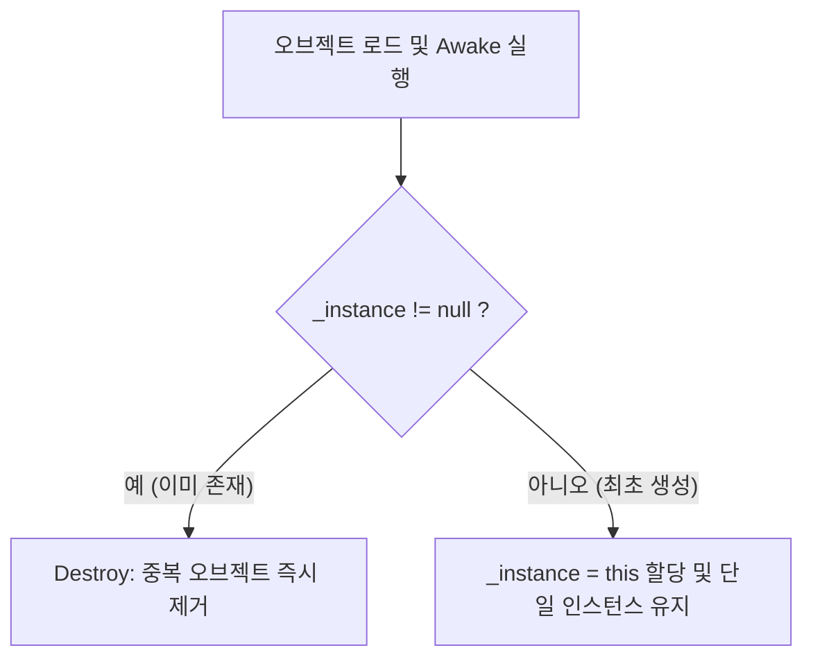

## 싱글턴 패턴 (Singleton Pattern)

특정 클래스의 인스턴스를 단 하나만 생성하도록 보장하고, 그 인스턴스에  전역적인 접근점을 제공하는 디자인 패턴
___

일반적으로 매니저를 개발할 때 싱글턴 패턴이 적합하므로, `ScoreManager`를 설계하는 방향으로 기술하도록 한다.

우선 `static`으로 두 가지 클래스를 선언한다.

첫 번째로 선언한 클래스는 실제 데이터 저장소(Backing Field)다. 
- `ScoreManager` 내부에서만 실행할 수 있다.
- `private`이므로 외부에서 접근이 불가능하다. 

두 번째로 선언한 클래스는 외부 공개용 통로 (Property)
- `public`이므로 다른 클래스에서 싱글톤에 접근할 수 있게 한다.
- `=> _instance` 는 읽기 전용(Get-Only) 프로퍼티 문법으로, 외부에서는 읽기만 가능하고 새로운 값을 할당(=)할 수 없다.

```csharp
public class ScoreManager : MonoBehaviour
{
    // 싱글턴 패턴
    // 1. 전역적으로 접근이 가능함
    // 2. 인스턴스가 하나임을 보장한다.
    private static ScoreManager _instance;
    public static ScoreManager Instance => _instance;
}
```
다음으로, 유니티에서 인스턴스가 생성되었을 때, 클래스가 하나만 존재하도록 하는 코드를 작성한다.
- 인스턴스가 처음에 생성된다면, 하단부의 코드에 의해 _instance 변수에 자신을 넣는다.
- 인스턴스가 중복 생성된다면, if 절의 검사문에 의해 자기 자신을 삭제해 중복 생성을 방지한다.

```csharp
public class ScoreManager : MonoBehaviour
{
    private static ScoreManager _instance;
    public static ScoreManager Instance => _instance;

    private void Awake()
    {
        // 중복 생성 방지 코드로, 이미 인스턴스가 있으면 자신을 제거한다.
        if (_instance != null)
        {
            Destroy(gameObject);
            return;
        }
        _instance = this;
    }
}
```



다음은 유니티에서 최고 점수를 저장하고 불러오는 기능을 추가한 전문이다.

`GetScore()`, `AddScore()`

- 현재 score를 리턴하고 추가하는 기능

`RefreshText()`

- 유니티의 UI 텍스트 오브젝트를 갱신하는 기능

`LoadData()`
- 데이터를 간편하게 저장하고 불러오는 PlayerPrefs 클래스를 사용해서 최고 점수를 불러옴

PlayerPrefs는 Key-Value 형태로 데이터를 관리하며 `int`, `float`, `string` 세 가지 데이터 타입만 지원한다.

```csharp
using System;
using TMPro;
using UnityEngine;

public class ScoreManager : MonoBehaviour
{
    // 싱글턴 패턴
    // 1. 전역적으로 접근이 가능함
    // 2. 인스턴스가 하나임을 보장한다.
    private static ScoreManager _instance;
    public static ScoreManager Instance => _instance;

    // 관리: 특정 데이터에 대한 무결성과 추가, 수정, 삭제 등과 관련된 로직을 말함
    private int _bestScore;
    private int _currentScore;

    // 저장 키
    private const string SaveKey = "BestScore";

    // UI 책임 추가
    [SerializeField] private TextMeshProUGUI _bestScoreText;
    [SerializeField] private TextMeshProUGUI _currentScoreText;

    private void Awake()
    {
        // 중복 생성 방지 코드
        if (_instance != null)
        {
            Destroy(gameObject);
            return;
        }

        _instance = this;
    }

    private void Start()
    {
        LoadData();
    }

    // Getter
    public int GetScore()
    {
        return _currentScore;
    }

    // Setter
    public void AddScore(int score)
    {
        if (score <= 0) return;

        _currentScore += score;
        if (_currentScore > _bestScore)
        {
            _bestScore = _currentScore;

            // 저장: PlayerPrefs.Set~ 시리즈를 이용해서 int/float/string을 저장 가능
            // 내 컴퓨터 어딘가에 저장이 된다
            PlayerPrefs.SetInt(SaveKey, _bestScore);
            PlayerPrefs.Save();
        }

        RefreshText();
    }

    private void RefreshText()
    {
        _bestScoreText.text = $"Best Score: {_bestScore}";
        _currentScoreText.text = $"Score: {_currentScore}";
    }

    private void LoadData()
    {
        if (PlayerPrefs.HasKey(SaveKey))
        {
            _bestScore = PlayerPrefs.GetInt(SaveKey);
        }

        _bestScore = PlayerPrefs.GetInt(SaveKey, 0);

        RefreshText();
    }
}
```

### 장점

- **<u>편리한 데이터 공유</u>**: 여러 스크립트에서 참조를 일일이 연결(GetComponent나 Find)하지 않고도 즉시 접근해 사용 가능
- <u>**메모리 절약 및 제어**</u>: 동일한 객체를 무분별하게 생성하는 것을 막을 수 있음

### 단점 및 주의점
- <u>**높은 결합도(Tight Coupling)**</u>: 어디서든 접근할 수 있다 보니, 코드 간의 의존성이 커져 나중에 특정 클래스만 수정하거나 테스트하기 어려워질 수 있음
- <u>**상태 관리의 어려움**</u>: 전역 변수처럼 동작하므로, 어디서 이 값을 변경했는지 추적하기가 까다로워질 수 있음
