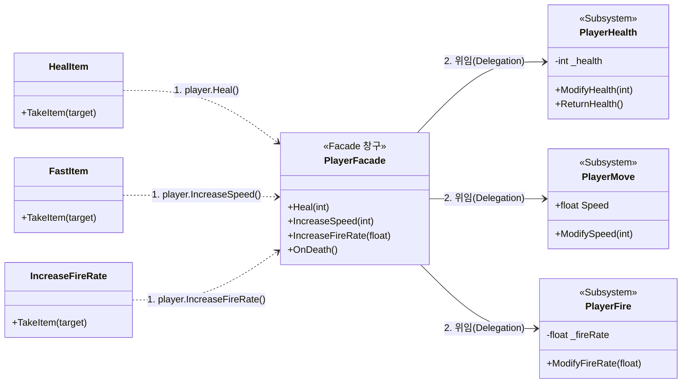

## 퍼사드 패턴 (Facade Pattern)
- 복잡한 서브시스템(클래스/모듈들의 집합)에 대해 하나의 단순화된 인터페이스(창구)를 제공하는 구조적 디자인 패턴
- 복잡한 내부 구조를 감추고 사용자가 쉽게 다룰 수 있도록 하나의 단순한 상위 인터페이스를 제공하는 방식이다. 복잡한 내부 동작 방식을 몰라도, 퍼사드가 제공하는 단일 메서드만 호출하여 원하는 작업을 처리할 수 있음

다음은 퍼사드 패턴의 역할을 나타낸 순서도다. 퍼사드의 메서드를 실행하면 그 아래의 하위 시스템들이 동작하는 구조이다.
```plainText
[Client] ──> [Facade] ──┬──> [Subsystem A]
                        ├──> [Subsystem B]
                        └──> [Subsystem C]
```
이번 예제에서는 이미 있는 프로젝트를 활용해서 설명하도록 하겠다.

기존 코드를 먼저 보겠다. 다음은 Item 클래스를 상속받는 3개의 구체 클래스이다.

세 가지 클래스 모두 GetComponent<>() 메소드를 이용해 target 변수에 할당하고 값을 재할당하는 구조다. 이러한 구조는 외부 스크립트가 대상의 내부 컴포넌트 구조를 알고 있어야 하는 문제가 있다. 이는 코드의 결합도를 높이는 문제를 야기한다.
```csharp
// FastItem.cs
public class FastItem : Item
{
    protected override void TakeItem(GameObject target)
    {
        PlayerMove playerHealth = target.GetComponent<PlayerMove>();
        playerHealth.ModifySpeed(3);
    }
}

// HealItem.cs
public class HealItem : Item
{
    protected override void TakeItem(GameObject target)
    {
        PlayerHealth playerHealth = target.GetComponent<PlayerHealth>();
        playerHealth.ModifyHealth(1);
    }
}

// IncreaseFireRate.cs
public class increaseFireRate : Item
{
    protected override void TakeItem(GameObject target)
    {
        PlayerFire playerFire = target.GetComponent<PlayerFire>();
        playerFire.ModifyFireRate(0.1f);
    }
}
```
이를 해결하기 위해 PlayerFacade.cs 라는 스크립트를 만들어서 중앙 관리 해보도록 하겠다. 유니티 라이프사이클에 의해, 객체가 생성될 때 내부 서브시스템들을 먼저 할당한 뒤에, 단일 기능들을 연결해준다.

*현재 연결한 기능들은 메서드 하나만 실행하는 단순한 로직이다. 따라서 복잡한 인터페이스를 대체하는 것처럼 보이지는 않지만, 한 번에 많은 작업을 해야한다면 해당 작업에 여러가지 메서드를 실행하도록 배치하면 된다.

```csharp
using UnityEngine;

/*
유니티에서 제공하는 **속성(Attribute)**으로
"이 스크립트가 정상 동작하려면 해당 컴포넌트가 
반드시 같은 게임오브젝트에 함께 붙어 있어야 한다"고 
유니티 에디터에 명시하는 안전장치 문법
*/
[RequireComponent(typeof(PlayerMove))]
[RequireComponent(typeof(PlayerHealth))]
[RequireComponent(typeof(PlayerFire))]


public class PlayerFacade : MonoBehaviour
{
    // 1. 내부 서브시스템 캐싱
    private PlayerMove _playerMove;
    private PlayerHealth _playerHealth;
    private PlayerFire _playerFire;

    private void Awake()
    {
        _playerMove = GetComponent<PlayerMove>();
        _playerHealth = GetComponent<PlayerHealth>();
        _playerFire = GetComponent<PlayerFire>();
    }

    // 2. 단일 기능 위임
    // 화살표 문법은 중괄호와 return을 생략하고 한 줄로 표기하는 방법
    public void IncreaseSpeed(int amount) => _playerMove.ModifySpeed(amount);
    public void Heal(int amount) => _playerHealth.ModifyHealth(amount);
    public void IncreaseFireRate(float amount) => _playerFire.ModifyFireRate(amount);

    // 3. 다중 컴포넌트 일괄 조율
    public void OnDeath()
    {
        _playerMove.enabled = false;
        _playerFire.enabled = false;
    }
}
```

마지막으로, 기존의 Item 클래스를 상속하는 구체 클래스들이 퍼사드를 이용하여 PlayerHealth, PlayerMove, PlayerFireRate 클래스의 값을 수정하도록 한다. 이 때, 파사드를 이용하는 클래스들은 퍼사드 내부의 구체적인 로직을 자세히 알 필요 없이 해당 작업을 실행하기만 하면 된다.
```csharp
// FastItem.cs
public class FastItem : Item
{
    protected override void TakeItem(GameObject target)
    {
        if(target.TryGetComponent<PlayerFacade>(out var player)){
            player.IncreaseSpeed(3);
        }
    }
}

// HealItem.cs
public class HealItem : Item
{
    protected override void TakeItem(GameObject target)
    {
        if (target.TryGetComponent<PlayerFacade>(out var player))
        {
            player.Heal(1);
        }
    }
}

// IncreaseFireRate.cs
public class increaseFireRate : Item
{
    protected override void TakeItem(GameObject target)
    {
        if(target.TryGetComponent<PlayerFacade>(out var player))
        {
            player.IncreaseFireRate(0.1f);
        }
    }
}
```

변경한 퍼사드 패턴을 다이어그램으로 변환하면 다음과 같다.




Facade Pattern 도식화
### 장점
- <u>**복잡성 은닉**</u>: 복잡한 시스템을 숨기고 간편한 인터페이스 제공
- <u>**결합도 감소**</u>: 클라이언트 코드가 서브시스템에 직접 의존하지 않음
- <u>**가독성 및 유지보수 향상**</u>: 내부 변경이 클라이언트 코드에 미치는 영향 최소화

### 단점
- <u>**전지전능 객체(God Object) 위험**</u>: 퍼사드 클래스가 모든 클래스에 의존하여 거대해질 수 있음
- <u>**추가 레이어 생성**</u>: 단순한 구조에 도입할 경우 오히려 코드 관리 비용 증가
